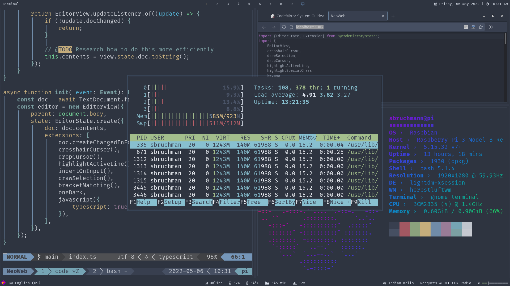

# Dotfiles

**Note**: This repository is currently in a state of constant flux.

---

---

## Info

- Shell: [Bash](https://www.gnu.org/software/bash)
- WM: [Herbstluftwm](https://herbstluftwm.org/)
- Bar: [Polybar](https://github.com/polybar/polybar/)
- Launcher: [Rofi](https://davatorium/rofi/)
- Editor: [Neovim](https://github.com/neovim/neovim/)
- Colors: [Nord](https://nordtheme.com/)

## Acknowledgments

My polybar config is based on [Hack](https://github.com/adi1090x/polybar-themes/tree/master/simple/hack/) by [@adi1090x](https://github.com/adi1090x/) and heavily modified.

## License

[MIT license](./LICENSE).
